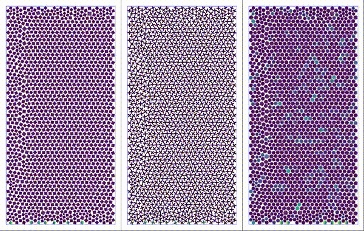
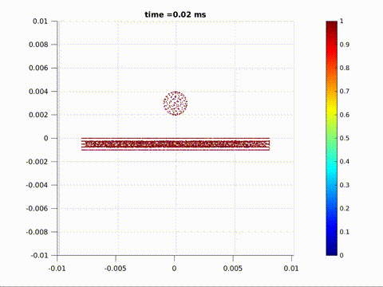

# perigrain

A high-fidelity granular media simulation and analysis platform with grain deformation and fracture using peridynamics and discrete element method

 

# Installation

```bash
# system packages
sudo apt-get install -y libhdf5-serial-dev gmsh python3-tk

# eigen library
wget -c https://gitlab.com/libeigen/eigen/-/archive/3.3.9/eigen-3.3.9.tar.gz 
mkdir lib
tar -xvf eigen-3.3.9.tar.gz -C lib/
rm eigen-3.3.9.tar.gz

# python packages
python3 -m venv env
source env/bin/activate
pip3 install -r requirements.txt

# generate the executable
make 
```

## Dependencies

* [Eigen](http://eigen.tuxfamily.org/index.php?title=Main_Page) (Specify the location of the `Eigen` library path in `makefile` if using other versions)
* `gmsh` to generate mesh:
* To read `hdf5` files on Linux using `h5dump`:
* Python packages
    * `matplotlib`, `numpy` as usual
    * mesh related python dependencies (`pip3 install`): `pygmsh`, `gmsh`, `meshio`
    * optimization using `gekko`
    * parallel processing using `multiprocessing`, `pathos`

Tested on:

- Ubuntu 18.04
- Ubuntu 20.04
- Ubuntu 22.04


# Experiment setup and running


## Sample simulations

There are sample scripts in the `/scripts` directory. Just call the executable `run.sh`.

* Specify the experiment in `gen_setup.py`. This uses dictionaries:
  * `exp_dict.py`
  - `shape_dict.py`
  - `material_dict.py`

## Custom simulations

* Write your own simulation setup in a function called `new_function()` in the file `exp_dict.py`. Particle geometry and material and contact parameters are set here.
* In `gen_setup.py`, add the line `exp = exp_dict.new_function()`.
* Specify the timesteps and simulation parameters in `config/main.conf`. Here, you can toggle various runtime features.

Then run:

```bash
# Generate the setup and setup.png
python3 gen_setup.py

# Copy `meshdata/all.h5` to `data/hdf5/all.h5`
make getfresh_py

# run the time integration steps (or ex3 for 3d)
make ex2

# generation simulation plots
make genplot
```

# Cite

```bibtex
@article{bhattacharya2021simulating,
  title={Simulating grain shape effects and damage in granular media using PeriDEM},
  author={Bhattacharya, Debdeep and Lipton, Robert P},
  journal={arXiv preprint arXiv:2108.07212},
  year={2021}
}
```
